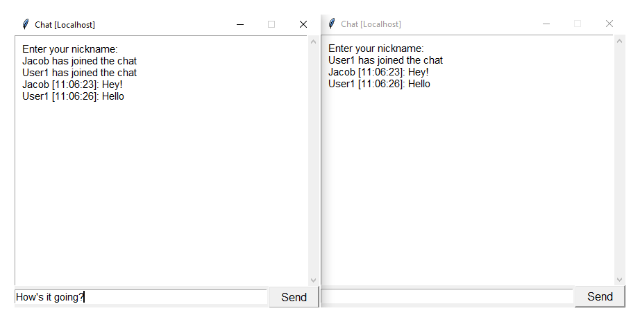
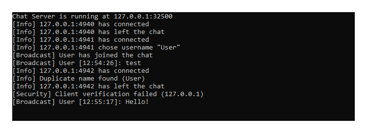

# Chat Server
A chat application prototype written in Python.



Features detailed logs, basic consistency checks of incoming data streams.



The application is just a prototype, not fit for production. It lacks encryption and advanced spam detection.

## Prerequisites
- Python (3.9.1)
- "Screen" Utility on Linux (optional)

## Running
### Local
First try running the server locally. Click on `server.py` and access it with `client.pyw`, that's it. Remember you can run multiple clients locally.

### Remote
For remote server, edit the header of both `server.py` and `client.pyw` to match your server's IP.
```
HOST = "192.168.0.1"
```

Use `start.sh` and `stop.sh` for automated deployment on Linux
```
./start.sh
```

Access the server by typing
```
screen -r
```

Detach it by pressing `Ctrl + A + D`

## Troubleshooting
If you lost your SSH connection while in screen and you can't access the server use
```
screen -d -r
```